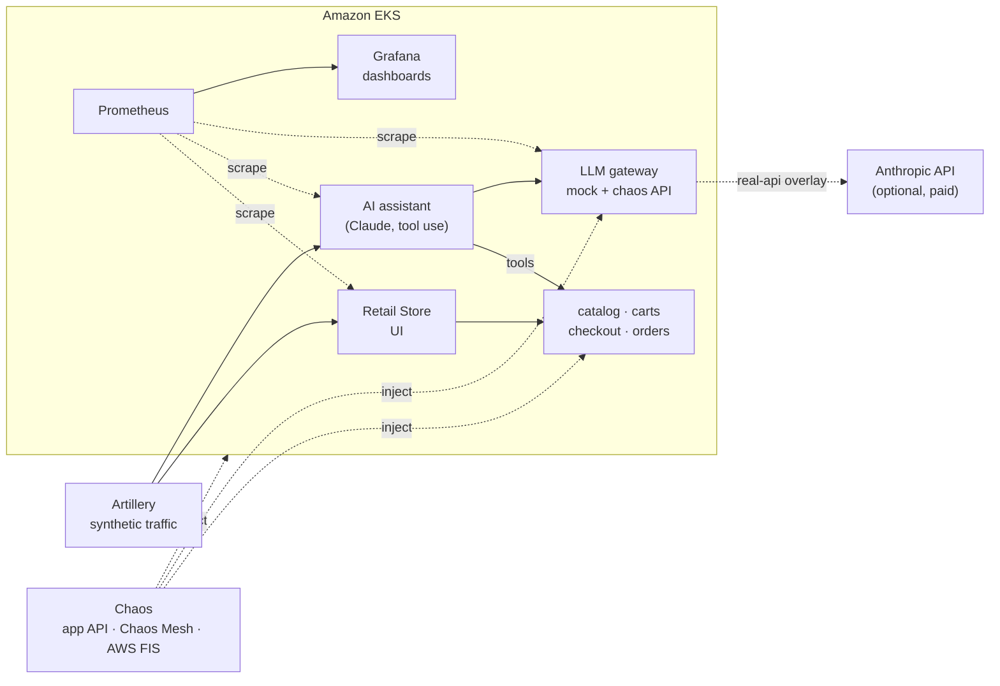

# eks-incident-lab

**A hands-on incident-response lab on Amazon EKS.**
Break a microservices store and an AI shopping assistant on purpose, then detect, diagnose and fix the outage, like in a real on-call shift.


## Why this lab

- **Real exercises, not demos.** Every scenario has a hypothesis, signals to watch, a runbook and a hidden solution. You find the cause yourself.
- **AI failures, not only classic ones.** Rate-limited LLM APIs, slow models, and silent failures where the assistant answers with HTTP 200 but the answer is useless.
- **Three layers of chaos.** Application (built-in chaos APIs), Kubernetes ([Chaos Mesh](https://chaos-mesh.org/)) and AWS ([Fault Injection Service](https://aws.amazon.com/fis/)).
- **Cheap and disposable.** Spot nodes, no NAT gateway by default, everything removed with one `tofu destroy`. About $0.20 per hour, ~$0.35 for a typical session.

## How it works



Every practice session follows the same loop:

1. **Steady state** - traffic runs, dashboards are green.
2. **Inject** - one command breaks something.
3. **Observe** - what changes in Grafana, and how fast?
4. **Diagnose** - find the cause with `kubectl`, logs and metrics.
5. **Recover and verify** - fix it the way you would in production, then confirm the steady state is back.

## Scenarios

| Scenario | Layer | Difficulty | What you learn |
|---|---|---|---|
| [orders-http-500](chaos/scenarios/level-1-application/orders-http-500/) | app | ⭐ | "Running" and "Ready" do not mean "working" |
| [catalog-latency](chaos/scenarios/level-1-application/catalog-latency/) | app | ⭐⭐ | slow is harder to spot than broken |
| [llm-rate-limit](chaos/scenarios/level-1-application/llm-rate-limit/) | app (AI) | ⭐ | SDK retries multiply load on a rate-limited API |
| [llm-slow](chaos/scenarios/level-1-application/llm-slow/) | app (AI) | ⭐⭐ | agent latency is the sum of every LLM and tool call |
| [ai-tool-cascade](chaos/scenarios/level-1-application/ai-tool-cascade/) | app (AI) | ⭐⭐⭐ | HTTP 200 with a useless answer: a silent failure |
| [catalog-db-pod-kill](chaos/scenarios/level-2-kubernetes/catalog-db-pod-kill/) | Kubernetes | ⭐⭐⭐ | a database restart that loses its data |
| [checkout-redis-network-loss](chaos/scenarios/level-2-kubernetes/checkout-redis-network-loss/) | Kubernetes | ⭐⭐ | healthy pods, broken network between them |
| [node-spot-interruption](chaos/scenarios/level-3-aws/node-spot-interruption/) | AWS | ⭐⭐ | losing a spot node with a 2-minute warning |
| [node-terminate](chaos/scenarios/level-3-aws/node-terminate/) | AWS | ⭐⭐ | losing a node with no warning, capacity headroom |
| [az-network-disruption](chaos/scenarios/level-3-aws/az-network-disruption/) | AWS | ⭐⭐⭐ | an availability zone goes dark, tolerations and timeouts |

How to run them: [chaos/README.md](chaos/README.md).

## Quick start

Requirements: OpenTofu >= 1.10, AWS CLI with a configured profile, kubectl, **Helm 3** (kubectl's built-in kustomize does not work with Helm 4), Docker and [uv](https://docs.astral.sh/uv/) for the AI assistant.

### Local setup (once)

Nothing to set up besides AWS credentials: pass your profile with `--profile` (or set `AWS_PROFILE`).
The region is `eu-west-1`.

**OpenTofu state is local by default** (`terraform.tfstate` in each root, git-ignored). That is fine for one person on
one machine: the environment only exists during a session. Losing the file *while the cluster runs* means cleaning up by hand.

Optional, recommended if you keep the cluster up for longer or use several machines: **state in S3**.

```bash
cp backend.hcl.example backend.hcl   # git-ignored: set your bucket and region
```

`lab.py` then writes a git-ignored `backend_override.tf` into every OpenTofu root and moves existing state to S3
(or back to local files when you delete `backend.hcl`). Enable versioning on the bucket to be able to restore a damaged state.
Before running `tofu` by hand in S3 mode, run `uv run scripts/lab.py state-backend` once.

### Run

One command, the same on Windows, Linux and macOS:

```bash
cp infra/terraform.tfvars.example infra/terraform.tfvars   # optional: set your IP in api_allowed_cidrs
uv run scripts/lab.py up --profile <your-aws-profile>   # ~25 min: cluster, monitoring, store, AI assistant (mock LLM, free), traffic
```

It checks the tools first (OpenTofu >= 1.10, Helm 3, Docker, AWS credentials), asks before `tofu apply`,
waits for every rollout and prints the port-forward commands at the end. Safe to run again after an error.
Options: `--profile` (AWS profile; without it the `AWS_PROFILE` variable is used), `--no-ai` (skip the assistant, no Docker needed),
`--yes` (no prompts), `--dry-run` (print the commands only).

Then open Grafana (dashboards **Incident Lab / Retail Store** and **Incident Lab / AI Assistant**) and pick a scenario from the table above:

```bash
kubectl -n monitoring port-forward svc/kube-prometheus-stack-grafana 3000:80   # http://localhost:3000
```

> [!WARNING]
> This lab creates real AWS resources that cost money. Destroy everything when you are done:
>
> ```bash
> uv run scripts/lab.py down --profile <your-aws-profile>   # also destroys applied FIS scenarios and Kubernetes load balancers
> ```

<details>
<summary>What <code>lab.py up</code> runs, step by step</summary>

```bash
# 1. Cluster
cd infra && tofu init -backend-config=../backend.hcl && tofu apply && cd ..
aws eks update-kubeconfig --region eu-west-1 --name torm-eks

# 2. Monitoring (CRDs first)
kubectl kustomize --enable-helm platform/monitoring/crds | kubectl apply --server-side -f -
kubectl kustomize --enable-helm platform/monitoring | kubectl apply --server-side -f -

# 3. Store
kubectl apply -k apps/retail-store

# 4. AI assistant
uv run scripts/push_images.py
kubectl apply -k apps/ai-assistant/base

# 5. Traffic
kubectl apply -k traffic
kubectl apply -k traffic/ai-assistant
```

</details>

## Alerts

Hybrid alerting, all generated as code and unit-tested with `promtool`:

- **Symptoms** (what customers feel): 5 SLOs with multiwindow, multi-burn-rate alerts from the
  [Google SRE workbook](https://sre.google/workbook/alerting-on-slos/), windows scaled down 12x to fit a practice session.
  A total outage pages within about 2 minutes.
- **Causes** (why): threshold warnings such as `DataStoreNotReady` or `LlmRetryAmplification`, plus the kube-prometheus-stack defaults.
- **UI only** for now: Alertmanager and Grafana (firing alerts are annotations on the dashboards). Every alert links to the [runbook](docs/runbooks/alerts.md).

| SLO | Objective | Good event |
|---|---|---|
| store-availability | 99% | UI request without a 5xx status |
| store-latency | 95% | UI request faster than 1 s |
| assistant-availability | 95% | question answered |
| assistant-latency | 95% | question answered within 30 s |
| assistant-tool-quality | 95% | tool call returned data (catches HTTP 200 answers built on failed tools) |

```bash
kubectl -n monitoring port-forward svc/kube-prometheus-stack-alertmanager 9093:9093   # http://localhost:9093
uv run scripts/generate_alerts.py && uv run scripts/test_alerts.py                     # after changing alerts
```

## Cost

| Item | Public mode (default) | Private mode |
|---|---|---|
| EKS control plane | $0.10 / hour | $0.10 / hour |
| 2 × `t3.medium` spot nodes | ~$0.03 / hour | ~$0.03 / hour |
| Traffic between AZs, control plane logs, public IPs, EBS | ~$0.07 / hour | ~$0.06 / hour |
| NAT gateway | none | ~$0.05 / hour + ~$0.05 / GB (~5 GB of images per session) |
| **Total per hour** | **~$0.20** | **~$0.25 + image downloads** |
| **Typical session** (setup + 1 hour of practice + teardown, ~1.7 hours) | **~$0.35** | **~$0.70** |
| AI assistant | free (mock LLM) | free (mock LLM) |
| AI assistant with the real Anthropic API | ~$1-2 / hour (Claude Haiku 4.5) | same |
| AWS FIS experiment | ~$0.10 per action-minute | same |

Estimates for `eu-west-1`. Check AWS Cost Explorer for real numbers.

## Network mode: `node_subnet_type`

| | `public` (default) | `private` |
|---|---|---|
| Worker nodes | public subnets, own public IPs | private subnets, no public IPs |
| Internet access | Internet Gateway (free) | NAT gateway (paid per hour and per GB) |
| Inbound traffic from the internet | blocked by security groups | blocked by security groups + no public IP |
| Closer to production | no | yes |

The EKS control plane network interfaces always stay in the private subnets. Choose the mode in `infra/terraform.tfvars`:

```hcl
node_subnet_type = "private"   # or "public" (default)
```

Switch modes while the cluster is **destroyed**. On a running cluster OpenTofu replaces the node group, so all pods restart.

## What is inside

| Path | Purpose |
|---|---|
| [`infra/`](infra/) | OpenTofu: VPC, EKS (spot node group), ECR. State in S3 with a lock file. |
| [`platform/monitoring/`](platform/monitoring/) | Prometheus + Grafana (kube-prometheus-stack via Kustomize + Helm). Dashboards as code, generated by `scripts/generate_dashboards.py`: golden signals, RED per service, saturation, chaos annotations |
| [`apps/retail-store/`](apps/retail-store/) | [Retail Store Sample App](https://github.com/aws-containers/retail-store-sample-app) from the EKS Workshop, pinned release + patches |
| [`apps/ai-assistant/`](apps/ai-assistant/) | AI shopping assistant + LLM gateway, mock by default ([README](apps/ai-assistant/README.md)) |
| [`services/`](services/) | Python source of our own services, with tests and Dockerfiles |
| [`traffic/`](traffic/) | [Artillery](https://www.artillery.io/) load generators for the store and the assistant |
| [`docs/runbooks/`](docs/runbooks/alerts.md) | What to do when an alert fires |
| [`chaos/`](chaos/) | Chaos Mesh engine, shared chaos Job, scenarios grouped by level, AWS FIS templates |
| [`scripts/`](scripts/) | `lab.py` (`up` / `down` for the whole lab), `push_images.py` (service images to ECR), `generate_dashboards.py`, `generate_alerts.py` + `test_alerts.py` (SLOs in `slo_definitions.py`) |

## Built with AI

This lab was built in pair-programming with [Claude Code](https://claude.com/claude-code), Anthropic's agentic coding tool.

- **The author** chose the goals, the architecture and every trade-off (OpenTofu over Terraform, public nodes to cut NAT costs, a mock LLM by default, scenario levels), reviewed each change and ran it on a real EKS cluster.
- **Claude Code** wrote most of the code, infrastructure and documentation, checked it (unit tests, `tofu plan`, `kustomize build`, `promtool`, local end-to-end runs) and fixed the issues found during practice sessions.
- **Commits** made with AI help carry a `Co-Authored-By: Claude` trailer, so the history shows the collaboration.

The repository conventions the AI follows are in [CLAUDE.md](CLAUDE.md).

## Details

- **Cluster defaults:** region `eu-west-1`, Kubernetes 1.36, 2 spot `t3.medium` nodes, public node subnets.
- **State:** local `terraform.tfstate` files by default; with `backend.hcl` in your S3 bucket (key `infra/terraform.tfstate`, locked with `use_lockfile`, no DynamoDB table).
- **Grafana** has no login: it is reachable only through `kubectl port-forward`.
- **Store UI:** `kubectl -n retail-store port-forward svc/ui 8080:80`, then http://localhost:8080.
- **More load:** `kubectl -n traffic scale deploy/load-generator --replicas=3`.

## License

[MIT](LICENSE)
